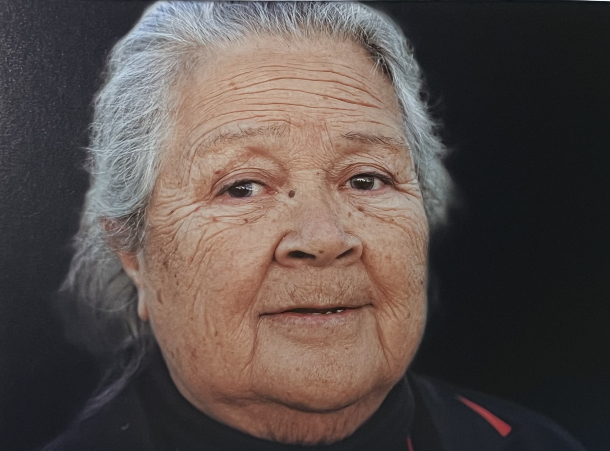

<html lang="zh-CN">
<head>
    <meta charset="UTF-8">
    <meta name="viewport" content="width=device-width, initial-scale=1.0">
    <title>安妮塔·约翰逊的故事</title>
    
</head>
<body>
    

        

            <h1>安妮塔·约翰逊的故事</h1>
        

        
        <!-- 图片卡片 -->
        

            

                
            

            
拍摄：周小平，2023年

            
            

                
就像一个"局外人"

                
"我既有原住民血统，也有中国人血统，在原住民学校的那些年里，我感觉自己像个'局外人'。当时我并不喜欢被称为'华人'，因为我认为自己是原住民。我曾经用化妆来掩饰我的华人相貌特征。但随着我长大了，开始珍惜自己所拥有的这两种文化。"

                
——安妮塔·约翰逊

            

        

        
        <!-- 语音部分 -->
        

            
聆听安妮塔的故事

            
点击下方播放按钮，收听安妮塔·约翰逊关于双重文化身份的完整讲述。

            <audio controls>
                <source src="声音：周小平.m4a" type="audio/mpeg">
                您的浏览器不支持音频元素。
            </audio>
            
声音：周小平

        

    

</body>
</html>
